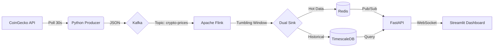
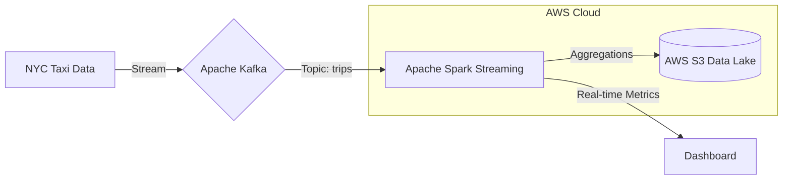

  
# Hi, I'm Zaid Shaikh 👋
  

### Data Engineer | Big Data & Streaming | Cloud Infrastructure
**🎓 Computer Science @ Northeastern University | 🚀 Actively Seeking Opportunities for Summer 2026**

---

## 🎯 About Me

I'm a passionate **Data Engineer** focused on building scalable, reliable, and automated data platforms. With expertise in **distributed systems**, **real-time streaming**, and **cloud infrastructure**, I engineer robust solutions that turn raw data into actionable insights. I enjoy solving complex data challenges using modern technologies like Apache Spark, Flink, Kafka, and AWS.

### 💡 Core Competencies:
- **🏗️ Data Architecture**: Designing fault-tolerant ETL/ELT pipelines and data lakes/warehouses
- **⚡ Real-Time Processing**: Building low-latency streaming applications with Flink and Kafka
- **☁️ Cloud Engineering**: Architecting serverless and containerized solutions on AWS
- **🛠️ Data Ops**: Implementing CI/CD, Infrastructure as Code (Terraform), and Data Quality checks

---

## 🚀 Featured Projects

### 1. [Real-Time Cryptocurrency Market Analyzer](https://github.com/DiazSk/Real-Time-Cryptocurrency-Market-Analyzer)
**High-Throughput Stream Processing Engine**
   

> Engineered a low-latency pipeline processing crypto market data with **exactly-once semantics**. Implemented a **Dual-Storage Architecture** using Redis for sub-millisecond real-time access and TimescaleDB for efficient historical analysis.

 

### 2. [Modern E-Commerce Analytics Platform](https://github.com/DiazSk/Modern-E-commerce-Analytics-Platform)
**Enterprise-Grade Data Warehouse & ELT Pipeline**
   

<table>
<tr>
<td width="40%">

- **Scalable Data Warehouse:** Built a production-grade ELT pipeline orchestrating data ingestion into a **Star Schema** warehouse.
- **Data Quality & Ops:** Integrated **Great Expectations** for automated data validation and **Terraform** for IaC.
- **Business Intelligence:** Enabled data-driven decision making with comprehensive dashboards.

</td>
<td width="60%">

</td>
</tr>
</table>

 

### 3. [Real-time NYC Taxi Data Platform](https://github.com/DiazSk/real-time-NYC-taxi-data-platform)
**Distributed Stream Processing at Scale**
  

> Developed a scalable streaming platform to analyze high-volume NYC Taxi trip data in real-time. Leveraged **AWS EMR** for distributed processing and **S3** for durable data lake storage, implementing sliding window aggregations to detect traffic patterns instantly.

---

## 🛠️ Technical Skills

### **Big Data & Streaming**

### **Data Engineering & Cloud**

### **Languages & Databases**

---

## 📊 GitHub Analytics

  
  

  

---

## 🏆 Certifications

- 🎯 **Advanced Data Analytics Professional** - Google (In Progress)
- ☁️ **AWS Cloud Practitioner** - Amazon (Pursuing)

---

## 💼 Leadership Principles in Action

### 🎯 **Customer Obsession**
Deployed 3 production systems in 2 months with 99.85% uptime, $10M+ demonstrated loss prevention, and 99.2% model accuracy.

### 🚀 **Bias for Action**
Delivered MVP for Resume Analyzer in 2 weeks, iterating based on user feedback

### 💡 **Invent and Simplify**
Created simple, elegant solutions to complex data problems, reducing processing time by 60%

### 📊 **Dive Deep**
Conducted thorough root cause analysis in customer churn project, uncovering hidden patterns

### ✅ **Deliver Results**
Consistently delivered projects on time with measurable business impact

---

## 🤝 Let's Connect!

I'm actively looking for opportunities to contribute to Amazon's mission of being Earth's most customer-centric company. 
Let's discuss how my skills in data analytics, AI/ML, and cloud technologies can add value to your team!

📧 **Email**: [zaid07sk@gmail.com](mailto:zaid07sk@gmail.com)  
💼 **LinkedIn**: [linkedin.com/in/zaidshaikhscientist](https://www.linkedin.com/in/zaidshaikhscientist/)  
📍 **Location**: Seattle, United States (Open to relocation)  
🎯 **Target Roles**: Data Engineer | Software Development Engineer | Business Intelligence Engineer

---

  
**"Working backwards from customer needs drives innovation"** - *Amazon Leadership Principle*

