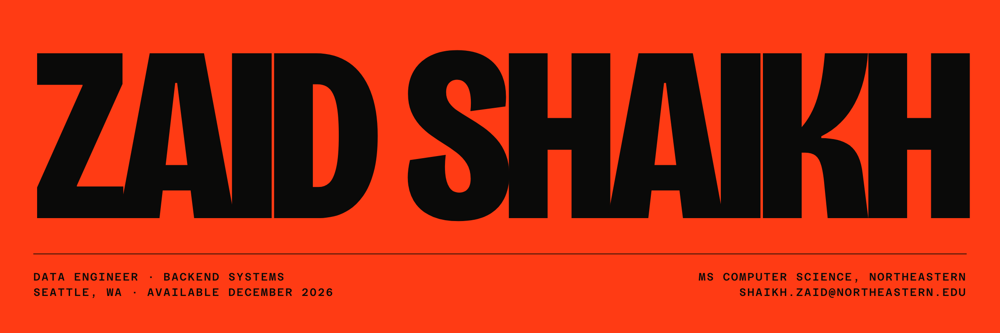
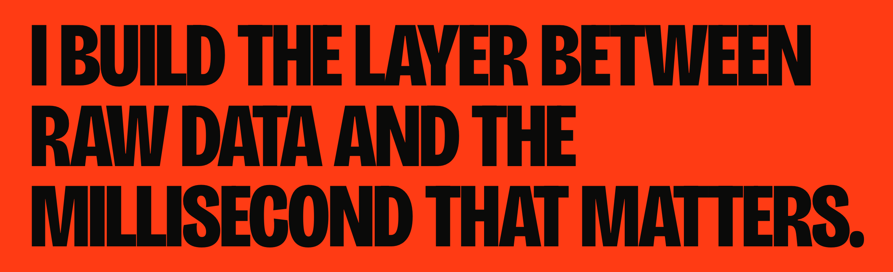
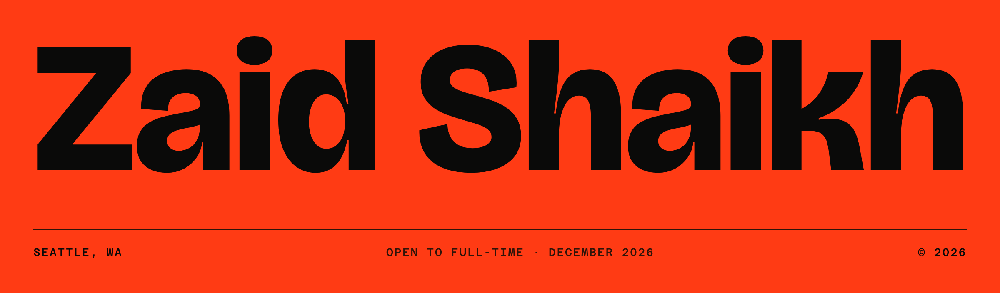

<a href="https://zaid-data.vercel.app/">
  
</a>

> I build the infrastructure layer — streaming pipelines, distributed warehouses, and
> high-throughput backend systems that move millions of records reliably.

[**PORTFOLIO →**](https://zaid-data.vercel.app/) · [**EMAIL →**](mailto:shaikh.zaid@northeastern.edu) · [**LINKEDIN →**](https://www.linkedin.com/in/zaidshaikhengineer/)

MS Computer Science, Northeastern University — December 2026, 4.0 GPA. Seattle, WA.
Open to full-time roles starting December 2026.

---

## HOW THESE WERE MEASURED

A number on its own is a claim. Each of these is the delta against the design it replaced.

| | | |
|:--|:--|:--|
| `01` | **21,091 msg/s** <br> `SUSTAINED THROUGHPUT` | Write-through coupled message consumption to MySQL's 2–5 ms insert latency, capping throughput near **500 msg/s** regardless of broker capacity. Write-behind persistence with in-memory batching decoupled the two paths — **42× the baseline**, zero data loss across 1M messages. |
| `02` | **<100 ms** <br> `END-TO-END LATENCY` | Market tick to rendered browser UI. 300 REST polls/min/user collapsed to **2 Kafka events** per market update — a 99% reduction — with Redis serving sub-1 ms hot reads to 20+ concurrent WebSocket clients. |
| `03` | **9.6M records** <br> `ACID, TIME-TRAVELLED` | 80 GB across Bronze, Silver and Gold layers. Raw Parquet gives throughput but no correctness guarantees; Delta Lake gives ACID concurrency, schema evolution without rewrites, and point-in-time reconstruction. **35% less Databricks compute** via partition pruning. |

---

## WORK

### [Chatflow — Real-Time Messaging Infrastructure](https://github.com/DiazSk/Chatflow-Messaging-System)

`▪ BACKEND ENGINEERING` · **21,091 msg/s sustained**

MySQL's 2–5 ms insert latency coupled message consumption to persistence speed under
write-through, capping throughput at roughly 500 msg/s regardless of broker capacity.
Write-behind persistence with in-memory batching (2k–5k rows/commit) decoupled the two
paths entirely. CQRS isolation kept read and write models independent, so write-side
failures could not starve read queries.

**Result:** 21,091 msg/s sustained · 13 ms read latency at 1M-row scale · zero data loss across 1M messages.

<details>
<summary><b>Architecture</b></summary>

```
WebSocket Gateway → RabbitMQ → Consumer Pool → In-Memory Batch Buffer → MySQL
                                     │                                    │
                                     └──────→ Redis (hot reads) ←──────────┘
                                              CQRS read model
```

Write path and read path never share a bottleneck. The batch buffer absorbs broker
bursts at memory speed; MySQL commits 2k–5k rows at a time behind it. Redis serves the
read model, so a stalled write never blocks a query.

</details>

`Java` `RabbitMQ` `Redis` `MySQL` `HikariCP` `WebSockets` `AWS EC2`

---

### [Healthcare Data Lakehouse — Clinical Pipeline on Azure](https://github.com/DiazSk/healthcare-lakehouse-azure)

`▪ DATA ENGINEERING` · **9.6M records, 80 GB**

Raw Parquet gives throughput but no correctness guarantees. When audit compliance is a
hard requirement, you need ACID transactions for safe concurrent writes, schema
evolution without table rewrites, and time-travel for point-in-time reconstruction.
Delta Lake provides all three. Raw Parquet provides none of them.

**Result:** 9.6M records · 80 GB across Bronze, Silver and Gold layers · 35% Databricks compute reduction via partition pruning and incremental loads.

<details>
<summary><b>Architecture</b></summary>

```
Source Systems → Azure Data Factory → ADLS Gen2 ┐
                                                │
          Bronze (raw, append-only) ────────────┤
          Silver (conformed, deduped) ──────────┤ Delta Lake · Databricks · PySpark
          Gold   (aggregated, serving) ─────────┘
                                                │
                                   Secrets ← Azure Key Vault
```

Each layer is a Delta table, so every promotion is a transaction. Time-travel makes any
audit question answerable against the table as it stood, not as it stands now.

</details>

`Azure Data Factory` `Delta Lake` `Azure Databricks` `PySpark` `Azure Key Vault` `ADLS Gen2`

---

### [Real-Time Crypto Analyzer — Full-Stack Streaming Platform](https://github.com/DiazSk/Real-Time-Cryptocurrency-Market-Analyzer)

`▪ SYSTEMS ENGINEERING` · **sub-100 ms end-to-end**

300 REST polling calls per minute per user was the baseline. The real constraint was
fan-out: as concurrent WebSocket users scaled, polling volume multiplied and upstream
rate limits became the bottleneck. Kafka pub/sub collapsed 300 calls to 2 events per
market update. Dual-path storage separates read concerns — Redis for sub-1 ms hot reads
serving 20+ concurrent WebSocket users, TimescaleDB for OHLC aggregations and cold
historical queries that would thrash an in-memory store.

**Result:** 99% polling reduction · sub-100 ms end-to-end latency from market tick to browser.

<details>
<summary><b>Architecture</b></summary>

```
Exchange Feed → Kafka → Flink (exactly-once) ┬→ Redis        → FastAPI → Next.js
                                             │  hot reads      WebSocket   browser
                                             └→ TimescaleDB
                                                OHLC / history
```

Fan-out happens once, at the broker, not once per user. Flink's exactly-once semantics
mean a replayed partition cannot double-count a tick.

</details>

`Next.js 16` `FastAPI` `Apache Kafka` `Apache Flink (Java)` `Redis` `TimescaleDB` `Docker`

---

### ALSO SHIPPED

| Result | Project |
|:--|:--|
| **2.8M** <br> `CLEAN RECORDS` | [**NYC Taxi Data Lakehouse**](https://github.com/DiazSk/NYC-Taxi-Data-Lakehouse) · `▪ DATA ENGINEERING` <br> 100 GB batch pipeline on AWS. Athena charges $5/TB scanned, so Glue runs deduplication, schema normalization and null-handling **once at ingest** — the clean layer becomes a guaranteed fact for downstream dbt models rather than a per-query assumption. 96.8% retention through quality gates, fully reproducible via Terraform. <br> `AWS Glue` `PySpark` `Apache Airflow` `dbt` `AWS S3` `Terraform` `Docker` |
| **146** <br> `AUTOMATED TESTS` | [**Scalable E-Commerce Analytics**](https://github.com/DiazSk/Modern-E-commerce-Analytics-Platform) · `▪ ANALYTICS ENGINEERING` <br> CLV attribution across 50K+ events. SCD Type 1 overwrites history; segment-level attribution needs to reconstruct which customer state drove which revenue event, so SCD Type 2 preserves the full dimension history. The 2–3× storage footprint is the deliberate trade. Query time 4.2 s → 1.1 s. <br> `Apache Airflow` `dbt` `PostgreSQL` `AWS S3` `Terraform` `Docker` |
| **90%** <br> `LATENCY REDUCTION` | [**E-Commerce Data Warehouse (Olist)**](https://github.com/DiazSk/sql-data-warehouse-project) · `▪ ANALYTICS ENGINEERING` <br> Snowflake schemas multiply join depth; wide tables double-count when orders and order items share a fact row. A strict star schema with **two grain-specific fact tables** resolves both — one grain, one join path, no aggregation ambiguity. 14 source systems, 1.6M+ records. <br> `Python` `PostgreSQL` `Snowflake` `Apache Airflow` `Docker` |



## STACK

| | |
|:--|:--|
| `DATA PLATFORMS & PIPELINES` | `Apache Spark (PySpark)` `Apache Airflow` `Apache Kafka` `Apache Flink` `dbt` `Azure Data Factory` `RabbitMQ` <br> ETL/ELT pipelines · Medallion architecture |
| `STORAGE & DATABASES` | `PostgreSQL` `MySQL` `Redis` `TimescaleDB` `Snowflake` `Delta Lake` `DuckDB` `AWS S3` <br> MongoDB |
| `CLOUD & INFRASTRUCTURE` | `AWS` `Azure` `Terraform` `Docker` `GitHub Actions` <br> Glue · S3 · Redshift · IAM · CloudWatch · ADLS Gen2 · Databricks · Key Vault · GitLab CI · Jenkins |
| `LANGUAGES` | `Python` `Java` `SQL` `TypeScript` <br> Bash |
| `PRODUCT & APIS` | `FastAPI` `Next.js 16` `React 19` `WebSockets` <br> Tailwind CSS · shadcn/ui · Zod |
| `OBSERVABILITY & QUALITY` | `Great Expectations` `dbt tests` `Pytest` `JUnit` <br> data lineage · quality checks · pre-commit hooks · Power BI · Metabase · Streamlit |

---

## EXPERIENCE

**Research Co-author — The Laundering Effect** · Khoury College, Northeastern · Fall 2025 – Present
`▪ COLM 2026, UNDER REVIEW`

Measuring cumulative semantic erosion under iterative LLM paraphrasing across 36,800+
records. Implemented a composite Semantic Drift Score (SBERT / METEOR / ROUGE-L) that
surfaces trajectory-level degradation invisible to single-step metrics. 2 of 5 original
hypotheses reported refuted.

**Graduate Teaching Assistant — Machine Learning (CS6140)** · Khoury College, Northeastern · May 2026 – Present

Weekly office hours debugging student Python implementations of PCA, regression and
regularization. Graded assignments reviewing model code, train/test logic and written
analyses.

---

## OPEN TO THE RIGHT OPPORTUNITY

Full-time Data Engineering and Backend roles starting December 2026.

[**shaikh.zaid@northeastern.edu**](mailto:shaikh.zaid@northeastern.edu) · [**LinkedIn**](https://www.linkedin.com/in/zaidshaikhengineer/) · [**zaid-data.vercel.app**](https://zaid-data.vercel.app/)


