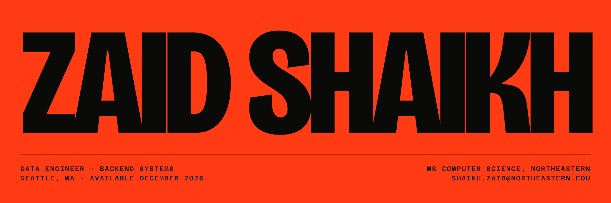
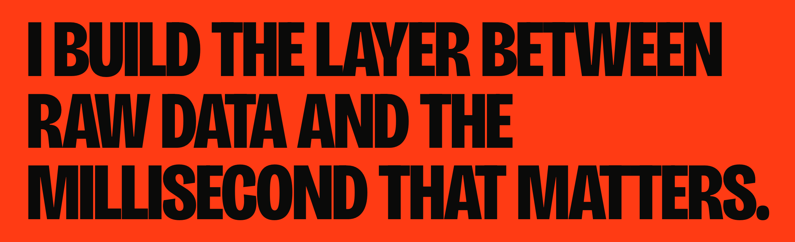
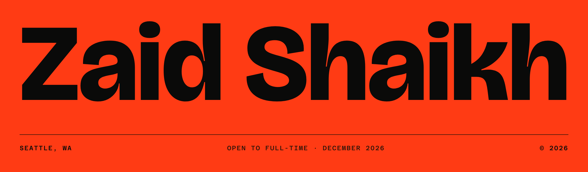

<a href="https://zaid-data.vercel.app/">
  
</a>

> I build the infrastructure layer — streaming pipelines, distributed warehouses, and
> high-throughput backend systems that move millions of records reliably.

[**PORTFOLIO →**](https://zaid-data.vercel.app/) · [**EMAIL →**](mailto:shaikh.zaid@northeastern.edu) · [**LINKEDIN →**](https://www.linkedin.com/in/zaidshaikhengineer/)

MS Computer Science, Northeastern University — December 2026, 4.0 GPA. Seattle, WA.
Open to full-time roles starting December 2026.

---

## HOW THESE WERE MEASURED

A number on its own is a claim. Each of these says how it was taken.

| | | |
|:--|:--|:--|
| `01` | **21,091 msg/s** <br> `SUSTAINED THROUGHPUT` | Write-through coupled message consumption to MySQL's 2–5 ms insert latency, capping throughput near **500 msg/s** regardless of broker capacity. Write-behind persistence with in-memory batching decoupled the two paths — **42× the baseline**, zero data loss across 1M messages. |
| `02` | **400 clients** <br> `LIVE FAN-OUT, 0 LOST` | Highest WebSocket step tested, every client receiving the same trades as the best-served one (delivery ratio 1.000) at **p95 166 ms** exchange-to-client. Across four injected faults — Flink TaskManager kill, Kafka restart, 30 s Postgres and Redis outages — **0 trades lost, 0 inconsistent candles**. |
| `03` | **2 of 5** <br> `HYPOTHESES REFUTED` | Five hypotheses written down before any transformation ran; two of them failed, and the dashboard publishes the failures instead of quietly dropping them. A headline "+2,223% premium" rested on **11 providers**, so it renders with a `thin sample` badge rather than as a finding — warn, don't hide. Measured over 9,660,252 Medicare claims, 13 quality gates and 108 tests. |

---

## WORK

### [Chatflow — Real-Time Messaging Infrastructure](https://github.com/DiazSk/Chatflow-Messaging-System)

`▪ BACKEND ENGINEERING` · **21,091 msg/s sustained**

MySQL's 2–5 ms insert latency coupled message consumption to persistence speed under
write-through, capping throughput at roughly 500 msg/s regardless of broker capacity.
Write-behind persistence with in-memory batching (2k–5k rows/commit) decoupled the two
paths entirely. CQRS isolation kept read and write models independent, so write-side
failures could not starve read queries.

**Result:** 21,091 msg/s sustained · 13 ms read latency at 1M-row scale · zero data loss across 1M messages.

<details>
<summary><b>Architecture</b></summary>

```
WebSocket Gateway → RabbitMQ → Consumer Pool → In-Memory Batch Buffer → MySQL
                                     │                                    │
                                     └──────→ Redis (hot reads) ←──────────┘
                                              CQRS read model
```

Write path and read path never share a bottleneck. The batch buffer absorbs broker
bursts at memory speed; MySQL commits 2k–5k rows at a time behind it. Redis serves the
read model, so a stalled write never blocks a query.

</details>

`Java` `RabbitMQ` `Redis` `MySQL` `HikariCP` `WebSockets` `AWS EC2`

---

### [Medicare Reimbursement Gap Analyzer — Lakehouse with In-Browser SQL](https://github.com/DiazSk/healthcare-lakehouse-azure)

`▪ DATA ENGINEERING` · **9.66M claims, served with no backend**

A cube cannot reproduce a row-level filter. Pre-aggregating the Gold marts made one
dashboard panel **41% wrong while still looking plausible** — the totals were internally
consistent, just answering a different question than the filter implied. A parity gate
now re-derives every panel from the fact table and fails the build on disagreement.
The same pass caught two of the 13 quality assertions that could never fail: a `NULL`
inside `isin("F","O",None)` makes the predicate `NULL` for every row, so the test
passed on any input. Serving is tiered Parquet read client-side by DuckDB-WASM over
HTTP range requests, so 9.66M rows are queryable with no backend at all.

**Result:** 9,660,252 claim rows from 3.06 GB source · full medallion run in **231 s on a laptop** · 13 quality gates, 10 parity assertions, 108 automated tests · **2 of 5 hypotheses refuted**, and the dashboard reports the refutations.

<details>
<summary><b>Architecture</b></summary>

```
CMS 2023 CSV (3.06 GB, public)
      │
      ├─ Azure path ····· Data Factory → ADLS Gen2 ← Key Vault / Entra ID (OAuth 2.0)
      │                   (original; subscription retired mid-project)
      └─ Local path ───── PySpark 3.5 + Delta 3.3, local[8]
                              │
        ┌─────────────────────┴─────────────────────┐
        │  Medallion notebooks — identical on both  │
        │  01 bronze→silver   28 explicit casts     │
        │  02 →gold dims      provider/hcpcs/geo    │
        │  03 →gold fact      NPI × HCPCS × POS     │
        │  04 →5 hero marts   99 DQ · 13 assertions │
        └─────────────────────┬─────────────────────┘
                              │
              tiered Parquet → DuckDB-WASM (GitHub Pages) · Power BI model
```

Every path resolves through one function, so `LAKEHOUSE_LOCAL_ROOT` redirects the whole
pipeline from cloud to laptop without a fork — which is what saved the project when the
Azure subscription was retired. The notebooks are byte-for-byte identical across both.

</details>

`PySpark 3.5` `Delta Lake` `Azure Databricks` `Azure Data Factory` `ADLS Gen2` `Azure Key Vault` `Terraform` `DuckDB-WASM`

---

### [Real-Time Crypto Analyzer — Streaming Market Terminal](https://github.com/DiazSk/Real-Time-Cryptocurrency-Market-Analyzer)

`▪ SYSTEMS ENGINEERING` · **400 concurrent clients, 0 lost trades**

Every trade for 8 Coinbase pairs, deduplicated on trade ID, rolled into 1-minute OHLCV
candles in **event time** — watermarks allow 2 s of out-of-order data — with an EWMA
z-score detector on top. Sinks carry different guarantees on purpose: JDBC writes are
insert-or-skip (effectively once), Kafka alerts are transactional and committed per 30 s
checkpoint (exactly once), Redis is at-least-once and clients dedupe. Chaos testing
earned its keep by finding a real bug: the API's pub/sub listener died on redis-py's own
`ConnectionError`, so live trades never resumed after a Redis restart. Fixed, and covered
by a test.

**Result:** 17,969 trades ingested with **0 duplicates and 0 missed** · REST p95 **12.8 ms** at 10 concurrent clients (1,640 req/s) · 400-client WebSocket fan-out at delivery ratio **1.000**, p95 166 ms exchange-to-client · 0 lost trades across a Flink TaskManager kill, a Kafka broker restart, and 30 s Postgres and Redis outages.

<details>
<summary><b>Architecture</b></summary>

```
Coinbase WS ─→ Python producer ─→ Kafka ─→ Apache Flink ─┬─→ TimescaleDB ─┐
               validation           4        dedup ·      │   + rollups    │
               gap tracking      partitions  1m OHLCV     ├─→ Redis ───────┼─→ FastAPI ─→ Next.js
                    ╰────── crypto:trades ──→ Redis       │   latest       │  REST + WS   terminal
                                              (live line) └─→ Kafka alerts ┘
                                                              exactly-once
Airflow (hourly):  backfill 90d candles → repair trade gaps → dbt build
                                                              48 nodes · 30 tests · 4 unit tests
```

Disagreement between the pipeline and Coinbase's official candles is reported in a mart,
never failed as a test — close price matches 99.5–100% of minutes on the liquid pairs.
Gap repair recovered 43 of 57 gaps **exactly by trade ID**; the 14 above the 10,000-trade
cap are skipped and logged rather than silently interpolated.

</details>

`Python` `Apache Kafka` `Apache Flink (Java)` `TimescaleDB` `Redis` `dbt` `Apache Airflow` `FastAPI` `Next.js` `Docker`

---

### ALSO SHIPPED

| Result | Project |
|:--|:--|
| **2.8M** <br> `CLEAN RECORDS` | [**NYC Taxi Data Lakehouse**](https://github.com/DiazSk/NYC-Taxi-Data-Lakehouse) · `▪ DATA ENGINEERING` <br> 100 GB batch pipeline on AWS. Athena charges $5/TB scanned, so Glue runs deduplication, schema normalization and null-handling **once at ingest** — the clean layer becomes a guaranteed fact for downstream dbt models rather than a per-query assumption. 96.8% retention through quality gates, fully reproducible via Terraform. <br> `AWS Glue` `PySpark` `Apache Airflow` `dbt` `AWS S3` `Terraform` `Docker` |
| **109.8M** <br> `REAL EVENTS` | [**E-commerce Funnel Lakehouse**](https://github.com/DiazSk/ecommerce-funnel-lakehouse) · `▪ ANALYTICS ENGINEERING` <br> REES46 clickstream, Oct–Nov 2019, on Databricks. Black Friday week lifted cart reach from 9.2% to **11.7%** (+2.5 pp, 95% CI +2.46 to +2.55) — but a four-day tracking gap nearly told the opposite story. Nov 15 logged 468,262 carts and **zero purchases**; leaving Nov 14–17 in the baseline reverses every headline result, and each reversal still looks statistically solid. The analysis finds the gap, measures what it costs, and excludes it. A dbt test now warns on any day with carts but no purchases. <br> `Databricks` `Delta Lake` `PySpark` `dbt` `Unity Catalog` `GitHub Actions` |
| **90%** <br> `LATENCY REDUCTION` | [**E-Commerce Data Warehouse (Olist)**](https://github.com/DiazSk/sql-data-warehouse-project) · `▪ ANALYTICS ENGINEERING` <br> Snowflake schemas multiply join depth; wide tables double-count when orders and order items share a fact row. A strict star schema with **two grain-specific fact tables** resolves both — one grain, one join path, no aggregation ambiguity. 14 source systems, 1.6M+ records. <br> `Python` `PostgreSQL` `Snowflake` `Apache Airflow` `Docker` |



## STACK

| | |
|:--|:--|
| `DATA PLATFORMS & PIPELINES` | `Apache Spark (PySpark)` `Apache Airflow` `Apache Kafka` `Apache Flink` `dbt` `Databricks` `Azure Data Factory` `RabbitMQ` <br> ETL/ELT pipelines · Medallion architecture · Asset Bundles · Unity Catalog |
| `STORAGE & DATABASES` | `PostgreSQL` `MySQL` `Redis` `TimescaleDB` `Snowflake` `Delta Lake` `DuckDB` `DuckDB-WASM` `AWS S3` <br> MongoDB |
| `CLOUD & INFRASTRUCTURE` | `AWS` `Azure` `Terraform` `Docker` `GitHub Actions` <br> Glue · S3 · Redshift · IAM · CloudWatch · ADLS Gen2 · Databricks · Key Vault · GitLab CI · Jenkins |
| `LANGUAGES` | `Python` `Java` `SQL` `TypeScript` <br> Bash |
| `PRODUCT & APIS` | `FastAPI` `Next.js 16` `React 19` `WebSockets` <br> Tailwind CSS · shadcn/ui · Zod |
| `OBSERVABILITY & QUALITY` | `Great Expectations` `dbt tests` `Pytest` `JUnit` <br> data lineage · quality checks · pre-commit hooks · Power BI · Metabase · Streamlit |

---

## EXPERIENCE

**Research Co-author — The Laundering Effect** · Khoury College, Northeastern · Fall 2025 – Present
`▪ COLM 2026, UNDER REVIEW`

Measuring cumulative semantic erosion under iterative LLM paraphrasing across 36,800+
records. Implemented a composite Semantic Drift Score (SBERT / METEOR / ROUGE-L) that
surfaces trajectory-level degradation invisible to single-step metrics. 2 of 5 original
hypotheses reported refuted.

**Graduate Teaching Assistant — Machine Learning (CS6140)** · Khoury College, Northeastern · May 2026 – Present

Weekly office hours debugging student Python implementations of PCA, regression and
regularization. Graded assignments reviewing model code, train/test logic and written
analyses.

---

## OPEN TO THE RIGHT OPPORTUNITY

Full-time Data Engineering and Backend roles starting December 2026.

[**shaikh.zaid@northeastern.edu**](mailto:shaikh.zaid@northeastern.edu) · [**LinkedIn**](https://www.linkedin.com/in/zaidshaikhengineer/) · [**zaid-data.vercel.app**](https://zaid-data.vercel.app/)


